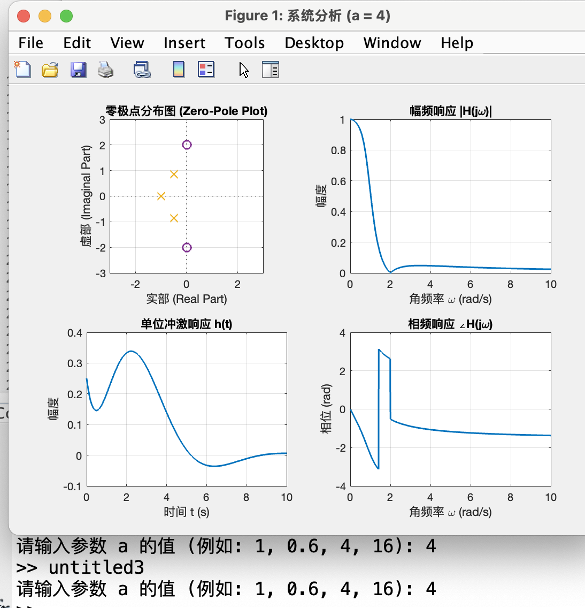

# UDP-Localsend


**Author:** JUNYAO SHI  
**ID:** 20233006416

## Description

UDP-Localsend is a Python-based command-line utility for transferring files and synchronizing folders between a client and a server over a local network using the UDP protocol. 

## Features

  * **Client-Server Architecture:** Simple and straightforward client-server model for file operations.
  * **File and Folder Operations:** Supports downloading and uploading of individual files and entire folders.
  * **Directory Navigation:** The client can navigate the server's designated file directory.
  * **Folder Synchronization:** Automatically synchronizes folder contents from the client to the server based on MD5 checksums. This includes adding new files, updating modified ones, and deleting obsolete ones.
  * **Configuration File:** Uses a `sync_config.json` file to manage multiple folder synchronization pairs.
  * **Robust Transfers:** Implements chunk-based transfers with acknowledgments for reliability.


## How to Use

### Prerequisites

  * Python 3

### Setup

1.  Place `server.py`, `client.py` in the same directory.
2.  The server will automatically create a `serverfile` directory for its files.
3.  The client will automatically create a `client_files` directory for its local files.

### Running the Server

Open a terminal and run the server script. You can optionally specify a port.

**Start with default port (51234):**

```bash
python3 server.py
```

**Start with a specific port:**

```bash
python3 server.py 8888
```

### Running the Client

Open another terminal to run the client. You can connect to the server by providing its hostname and port as command-line arguments.

**Connect directly:**

```bash
python3 client.py localhost 8888
```

**Interactive mode (will prompt for hostname):**

```bash
python3 client.py
```

If you use this method, you will be prompted to enter the server host. The default port is 51234.

## Command List

The client provides a menu of commands to interact with the server.

### File and Directory Commands

| Command | Description | Example |
| :--- | :--- | :--- |
| `<filename>` | Download a specific file from the server's current directory to the local `client_files` directory. | `example.txt` |
| `all` | Download all files from the server's current directory. | `all` |
| `upload <path>` | Upload a file from your local machine to the server's current directory. The path can be absolute or relative to `client_files`. | `upload my_document.pdf` |
| `supload <path>` | Upload an entire folder and its contents to the server's current directory. | `supload /path/to/my_folder` |
| `cd <folder>` | Change to the specified directory on the server. | `cd documents` |
| `cd ..` | Navigate to the parent directory on the server. | `cd ..` |
| `kill` | **DANGER:** Deletes every file and folder within the server's `serverfile` directory. | `kill` |
| `(press enter)` | Exit the client application. | |

### Synchronization Commands

These commands manage the synchronization of local and remote folder pairs.

| Command | Description | Example |
| :--- | :--- | :--- |
| `sync list` | Show all configured synchronization pairs from `sync_config.json`. | `sync list` |
| `sync add <local> <remote>` | Add a new folder pair to the configuration for synchronization. The local path must exist. | `sync add ./client_files/project1 project1_backup` |
| `sync remove <id>` | Remove a sync pair from the configuration using its ID. | `sync remove 1` |
| `sync run` | Perform a one-time synchronization for all configured pairs. It compares local and remote files using MD5 hashes and transfers only new or modified files. | `sync run` |
| `sync auto` | Start a continuous automatic synchronization mode. It will periodically run the sync process for all configured pairs until you press Enter. | `sync auto` |

## Configuration (`sync_config.json`)

The `sync_config.json` file defines which local directories should be synchronized with which remote directories on the server.

**Example `sync_config.json`:**

```json
[
  {
    "id": 1,
    "local_path": "/path/to/your/local/folder",
    "remote_path": "backup_on_server"
  }
]
```

  * `id`: A unique identifier for the sync pair.
  * `local_path`: The absolute or relative path to the folder on your client machine.
  * `remote_path`: The name of the folder on the server (relative to the `serverfile` directory) where the contents of `local_path` will be synchronized.